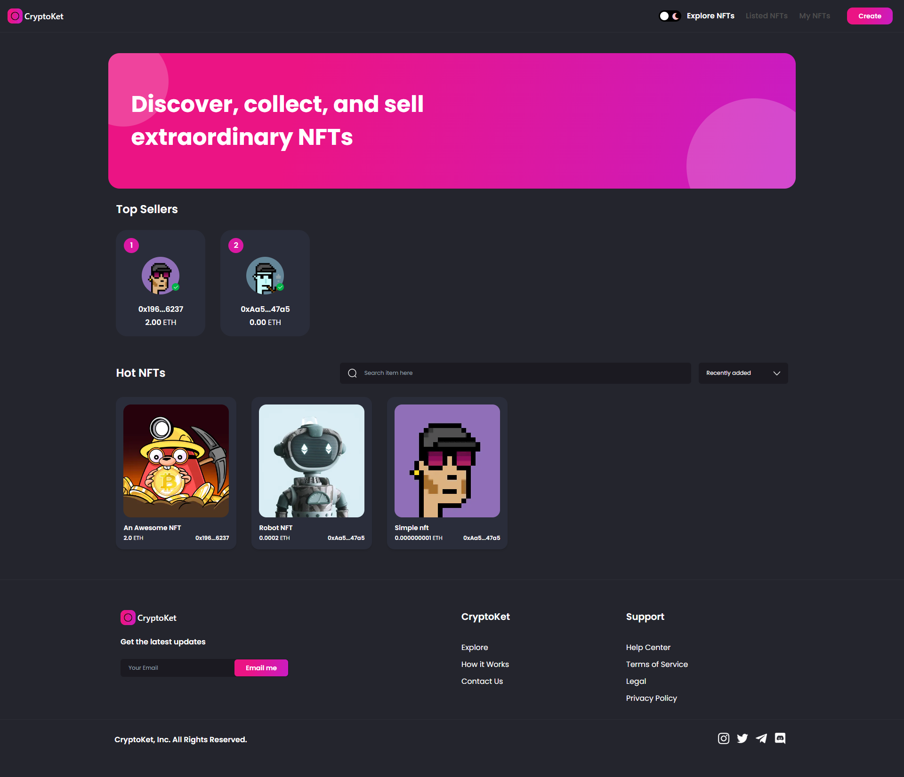
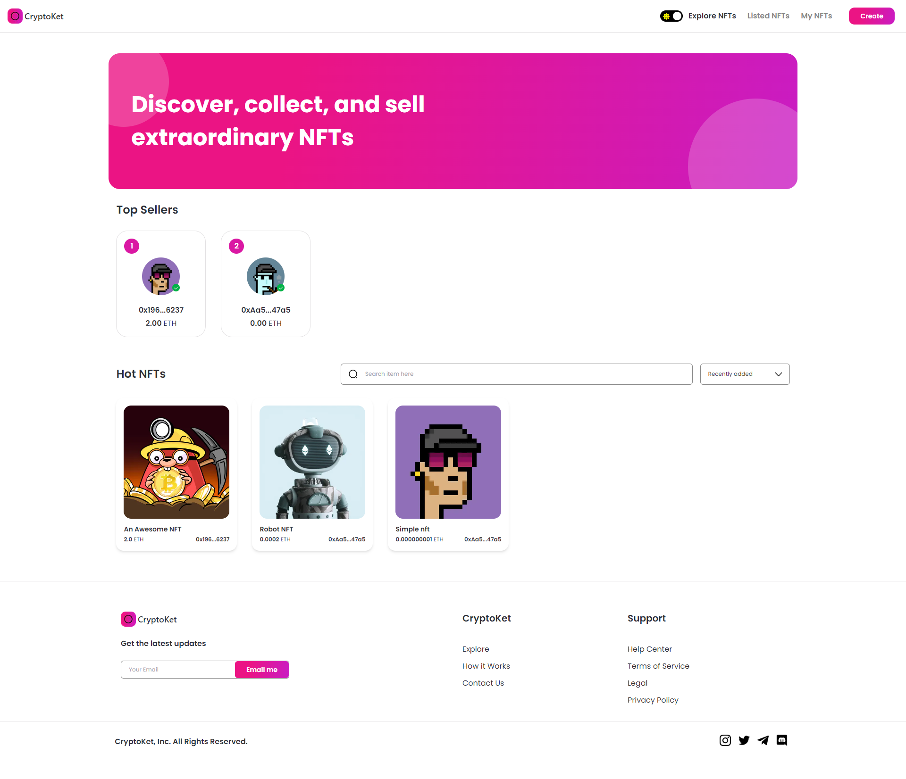
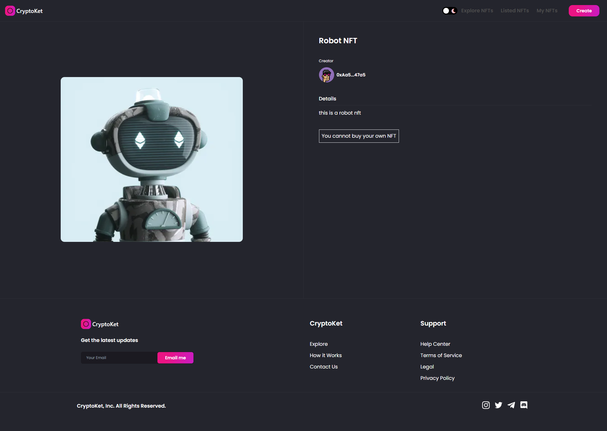
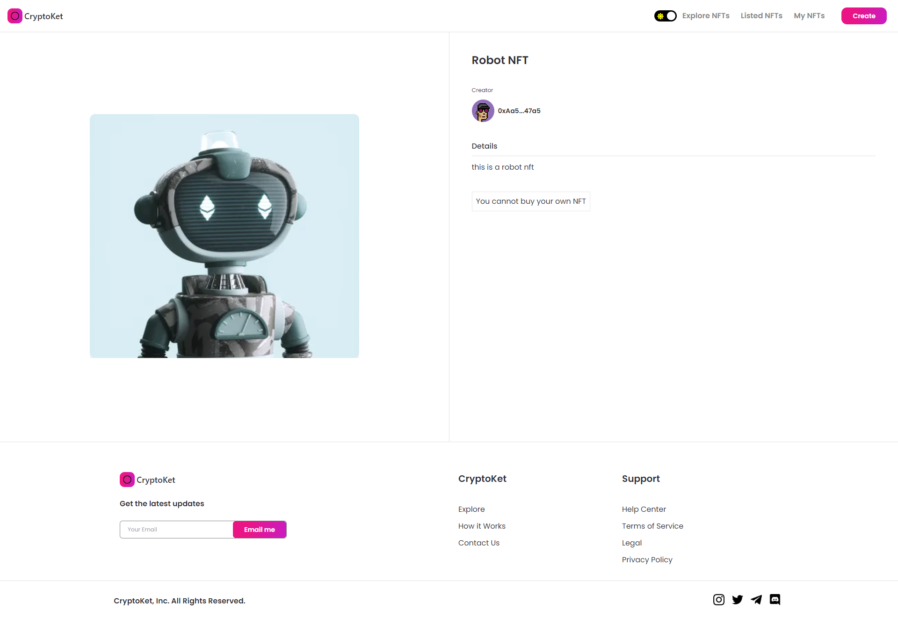

# NFT Marketplace Platform

### [NFT Marketplace on Netlify](https://nft-marketplace-infura.netlify.app/)

### [NFT Marketplace on Vercel](https://nft-marketplace-infura.vercel.app/)

### Tech Stack
```
# HTML, CSS, JavaScript
# Next.js, React Context Library, Tailwind CSS
# Solidity, ERC721, Hardhat, Ethers.js
```

### Instructions:

Install Dependencies
```shell
npm install
```

Run hardhat local blockchain
```shell
npx hardhat node
```

Deploy to hardhat localhost
```shell
npx hardhat run scripts/deploy.js --network hardhat
```

Deploy to Goerli Testnet
```shell
npx hardhat run scripts/deploy.js --network goerli
```

Copy the marketplace smart contract address after deployment. And paste it into context/constants.js

Example:
```shell
NFTMarketplace deployed to: 0x5FbDB2315678afecb367f032d93F642f64180aa3
```
```js
export const MarketAddress = '0x5FbDB2315678afecb367f032d93F642f64180aa3'
```

Create a .env file with the below content. Sign up for Infura free tier and create a project and use it's rpc_rul. Create IPFS Project as well for storing the nft images.
```shell
PRIVATE_KEY=****************       // Your ethereum wallet private key
RPC_URL=****************           // Your RPC url from Alchemy or Infura Project
IPFS_PROJECT_ID=****************  // The IPFS Project ID from your Infura IPFS Project
IPFS_API_KEY_SECRET=**************** // The IPFS API Key Secret from your Infura IPFS Project
```

Run local instance
```shell
npm run dev
```

### Screenshots








